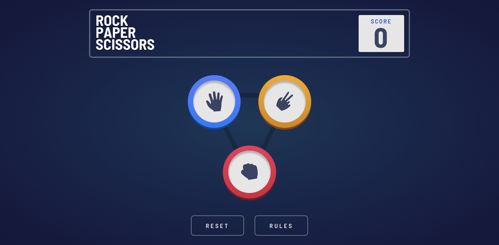

# Frontend Mentor - Rock, Paper, Scissors solution

This is a solution to the [Rock, Paper, Scissors challenge on Frontend Mentor](https://www.frontendmentor.io/challenges/rock-paper-scissors-game-pTgwgvgH). Frontend Mentor challenges help you improve your coding skills by building realistic projects.

## Table of contents

- [Frontend Mentor - Rock, Paper, Scissors solution](#frontend-mentor---rock-paper-scissors-solution)
  - [Table of contents](#table-of-contents)
  - [Overview](#overview)
    - [The challenge](#the-challenge)
    - [Screenshot](#screenshot)
    - [Links](#links)
  - [My process](#my-process)
    - [Built with](#built-with)
    - [What I learned](#what-i-learned)
    - [Continued development](#continued-development)
  - [Author](#author)
  - [Author](#author-1)

## Overview

### The challenge

Users should be able to:

- View the optimal layout for the game depending on their device's screen size
- Play Rock, Paper, Scissors against the computer
- Maintain the state of the score after refreshing the browser _(optional)_
- **Bonus**: Play Rock, Paper, Scissors, Lizard, Spock against the computer _(optional)_

### Screenshot

### Links

- Solution URL: [https://github.com/superschooler/rock-paper-scissors](https://github.com/superschooler/rock-paper-scissors)
- Live Site URL: [https://superschooler.github.io/rock-paper-scissors/](https://superschooler.github.io/rock-paper-scissors/)

## My process

### Built with

- Semantic HTML5 markup
- CSS custom properties
- Flexbox
- CSS Grid
- Mobile-first workflow
- [Tailwind CSS](https://tailwindcss.com/) - CSS Library

### What I learned

This project took a full day to complete once I got going, but roughly a month from the time I started it to actually getting to work and knocking it out. I had bounced around between projects and worked on freeCodeCamp and The Odin Project over the last month, and finally felt comfortable enough to tackle it. The DOM had always stumped me a bit when I got to it, largely because freeCodeCamp hardly touches on it. The Odin Project has proven to be an invaluable resource once getting past the basics, and I'd recommend it to anyone who's past the tinkering phase and ready to actually start learning and building projects.

I surprised myself by not having to Google all that much with this project - I'm comfortable working with HTML, CSS, TailwindCSS, and JavaScript, and only needed to Google a few concepts, like inset shadows.

I'm still figuring out where to draw the line between using TailwindCSS and vanilla CSS. I think Tailwind is great for formatting quickly and making media queries easy, but it can get a bit more complicated when it comes to custom colors or values outside of its presets. I know it's customizable, but is a small project like this worth going through the hassle of customizing it?

### Continued development

I'm excited to continue building projects that use more and more JavaScript and eventually getting into the back end. I plan to continue with The Odin Project's JavaScript course and when it asks for projects similar to what's offered on Frontend Mentor I'll complete the challenges there.

## Author

## Author

- Website - [Brian Schooler](https://www.brianschooler.com)
- Frontend Mentor - [@superschooler](https://www.frontendmentor.io/profile/superschooler)
- Twitter - [@superschooler](https://www.twitter.com/yourusername)- Website - [Brian Schooler](https://www.brianschooler.com)
- Frontend Mentor - [@superschooler](https://www.frontendmentor.io/profile/superschooler)
- Twitter - [@superschooler](https://twitter.com/SuperSchooler)
- GitHub - [@superschooler](https://github.com/superschooler)
